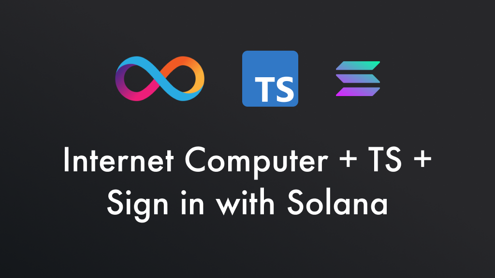

## Overview

This repository is a **Vanilla TypeScript + Vite** demo application and template for Sign‑In‑With‑Solana (SIWS) to an Internet Computer (IC) canister. By combining:

- **ic-siws-js** (SIWS authentication)
- **ic_siws_provider** canister (Rust)
- **solana-connect** (wallet connections)

you get a fully authenticated cross‑chain dapp where a Solana wallet maps one‑to‑one to an IC identity.

> [!NOTE]
> In addition to this vanilla TS demo of ic-siws, there are versions for React, Vue, Svelte, and more in the main [ic-siws](https://github.com/kristoferlund/ic-siws) repository.

### Highlights

- Sign in with Solana to interact with IC canisters
- One‑to‑one mapping between wallet and IC identity
- Leverage IC features: BTC/ETH integration, fast finality, low transaction fees, HTTPS outcalls, cheap data storage

## Live Demo

Try it live: <https://et233-aaaaa-aaaal-qsmvq-cai.icp0.io>

## Key features

The demo is built using [Vite](https://vitejs.dev/) to provide a fast development experience and uses plain TypeScript without any framework.

## Table of contents

- [App components](#app-components)
  - [Frontend](#frontend)
  - [IC SIWS Provider](#ic-siws-provider)
- [How it works](#how-it-works)
- [Run locally](#run-locally)
- [Details](#details)
  - [IC SIWS Provider](#ic-siws-provider-1)
  - [Frontend](#frontend-1)
- [Updates](#updates)
- [Contributing](#contributing)
- [License](#license)

## App components

This app consists of two main components:

### Frontend

The frontend is a vanilla TypeScript application built and bundled with Vite. All UI and login logic lives in `packages/frontend/src/main.ts`. It handles:

- Injecting HTML markup and CSS
- Connecting to a Solana wallet via `solana-connect`
- Driving the SIWS login flow through `ic-siws-js`
- Managing UI state (connect, login, logout, display public keys and principals)

In a production setup, this frontend would make authenticated calls to one or more application canisters.

### IC SIWS Provider

The pre-built IC SIWS Provider is a Rust canister that implements the SIWS login flow. It generates and verifies SIWS messages, and issues a Delegate Identity for the user.

## How it works

High‑level login flow:

1. Frontend requests a SIWS challenge message from the `ic_siws_provider` canister.
2. Frontend opens the user’s Solana wallet and prompts them to sign the message.
3. Frontend submits the signed message back to `ic_siws_provider` to authenticate.
4. Canister verifies the signature and returns a Delegate Identity.
5. Frontend stores the identity and uses it for authenticated calls.

## Run locally

```bash
# start dfx and local replica
dfx start --clean --background
# deploy canisters (frontend and provider)
make deploy-all
# start Vite dev server
cd packages/frontend && npm install && npm run dev
```

## Details

### IC SIWS Provider

Configured in [dfx.json](/dfx.json) as a custom canister:

```json
{
  "canisters": {
    "ic_siws_provider": {
      "type": "custom",
      "candid": "https://github.com/kristoferlund/ic-siws/releases/download/v0.0.2/ic_siws_provider.did",
      "wasm": "https://github.com/kristoferlund/ic-siws/releases/download/v0.0.2/ic_siws_provider.wasm.gz"
    },
    ...
  },
  ...
}
```

Initialization parameters (in `Makefile`):

```makefile
dfx deploy ic_siws_provider --argument "( \
    record { \
        domain = \"127.0.0.1\"; \
        uri = \"http://127.0.0.1:5173\"; \
        salt = \"salt\"; \
        chain_id = opt \"mainnet\"; \
        scheme = opt \"http\"; \
        statement = opt \"Login to the app\"; \
        sign_in_expires_in = opt 300000000000; /* 5 minutes */ \
        session_expires_in = opt 604800000000000; /* 1 week */ \
        targets = opt vec { \
            \"$$(dfx canister id ic_siws_provider)\"; \
        }; \
        runtime_features = null; \
    } \
)"
```

### Frontend

- **`main.ts`**: single entrypoint, injects DOM, binds buttons, subscribes to `siwsStateStore`, handles wallet events.
- **`state.ts`**: local state store for Solana adapter and UI context.
- **CSS**: simple `style.css` for layout and utility classes (e.g. `.hidden`).

## Updates

See the [CHANGELOG](CHANGELOG.md).

## Contributing

Pull requests and issues welcome.

## License

MIT License. See the [LICENSE](LICENSE) file.
